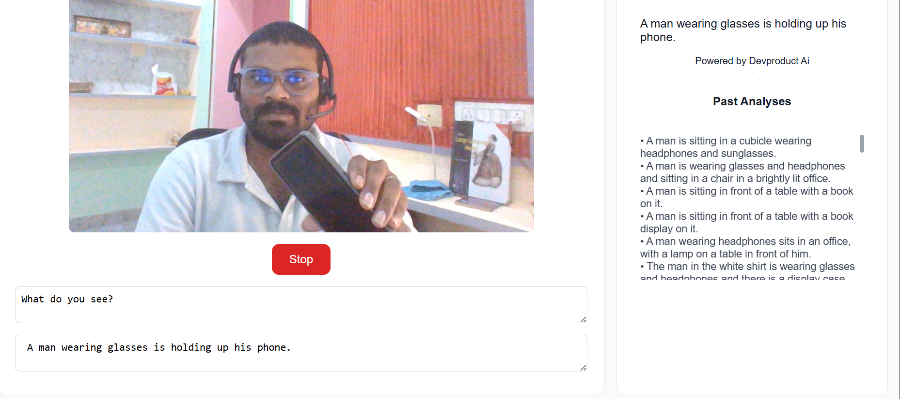

# 📸 SmolVLM Real-Time Camera Demo



This project is a simple demo showing how to use [llama.cpp](https://github.com/ggml-org/llama.cpp) with **SmolVLM 500M** for **real-time object detection** from your camera.

---

## 🚀 Features
- Real-time camera feed analysis
- Object detection powered by **SmolVLM 500M**
- Runs locally with `llama.cpp`
- Simple HTML + JavaScript frontend

---

## ⚙️ Prerequisites
Before you begin, make sure you have:
- A working **C++ compiler** (GCC/Clang/MSVC)
- **CMake** installed (v3.15+ recommended)
- **Python 3.8+** (optional, for extra tools)
- A **web browser** (to open `index.html`)
- (Optional) A supported **GPU** for acceleration (NVIDIA, AMD, or Intel)

---

## 🛠️ Installation

### 1. Clone and build llama.cpp
```bash
# Clone llama.cpp
git clone https://github.com/ggml-org/llama.cpp
cd llama.cpp

# Build (Linux/macOS)
make

# Build (Windows, using CMake)
cmake -B build
cmake --build build --config Release
```

### 2. Run the SmolVLM model server
```bash
./llama-server -hf ggml-org/SmolVLM-500M-Instruct-GGUF
```
Note: you may need to add `-ngl 99` to enable GPU (if you are using NVidia/AMD/Intel GPU)  
Note (2): You can also try other models [here](https://github.com/ggml-org/llama.cpp/blob/master/docs/multimodal.md)

### 3.Running the Demo
**Open index.html in your browser.**
- (You can just double-click it or serve it with a local server like python -m http.server.)
- Click Start to activate your webcam.
- Watch real-time detection results appear.

### 4.Repository Structure
```bash
SmolVLM
├── index.html      # Frontend for real-time camera demo
├── demo.png        # Screenshot of the demo
└── README.md       # Documentation (this file)
```

### 5. 🙌 Acknowledgements
- [llama.cpp](https://github.com/ggml-org/llama.cpp) for running LLMs locally
- [SmolVLM](https://huggingface.co/ggml-org/SmolVLM-500M-Instruct-GGUF) for lightweight vision-language modeling
